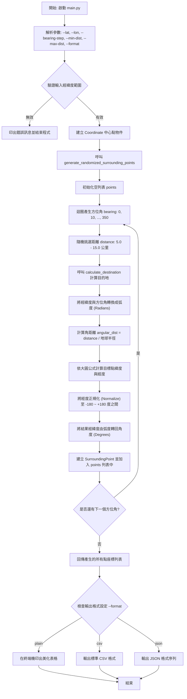

# Target Ship Surrounding Coordinates Generator (目標船艦周圍經緯度計算器)

本專案提供一個精簡且高效的 Python 工具，用以計算一個目標船艦（中心點）在特定距離與方位角（Bearing）下的周圍經緯度。

專案依據您的需求實作了：**以每 10 度為方位角間隔（共 36 個方位），並在各方位隨機產生一個距離在 5 到 15 公里之間的周圍點經緯度**。

---

## 流程圖 (Flowchart)

以下是此功能執行的完整邏輯流程圖：



---

## 數學計算原理

本工具採用**大圓航線公式 (Great Circle / Spherical Earth Navigation)** 計算球體表面上的新座標點。

給定起點的緯度 $\phi_1$ 與經度 $\lambda_1$、方位角 $\theta$ (以北為 0 度，順時針旋轉)，以及行進距離 $d$，地球平均半徑 $R \approx 6371.01 \text{ km}$。

### 1. 角距離 (Angular Distance)
$$\delta = \frac{d}{R}$$

### 2. 計算目的地緯度 $\phi_2$
$$\phi_2 = \arcsin\left(\sin\phi_1 \cdot \cos\delta + \cos\phi_1 \cdot \sin\delta \cdot \cos\theta\right)$$

### 3. 計算目的地經度 $\lambda_2$
$$\lambda_2 = \lambda_1 + \operatorname{atan2}\left(\sin\theta \cdot \sin\delta \cdot \cos\phi_1,\; \cos\delta - \sin\phi_1 \cdot \sin\phi_2\right)$$

最後將 $\lambda_2$ 正規化至 $[-180^\circ, 180^\circ]$ 區間，並將所有弧度轉回角度，即得目的地的經緯度。

---

## 專案目錄結構

```text
dist_cal/
├── pyproject.toml         # uv 專案設定檔
├── main.py                # 主程式入口 (CLI 介面)
├── demo.ipynb             # Jupyter Notebook 示範與視覺化
├── README.md              # 本說明文件
├── src/
│   └── ship_navigator/
│       ├── __init__.py    # 模組公開 API 導出
│       ├── models.py      # 資料結構模型 (Coordinate, SurroundingPoint)
│       └── calculator.py  # 座標運算核心 (大圓公式、隨機距離生成)
└── tests/
    └── test_calculator.py # 單元測試
```

---

## 使用教學

本專案使用 `uv` 虛擬環境管理。您可以使用虛擬環境中的 Python 進行操作。

### 1. 執行主程式（預設以表格呈現）
預設目標船艦位置為 `緯度 22.0, 經度 120.0`，您可以自訂經緯度：
```bash
.venv/bin/python main.py --lat 22.0 --lon 120.0
```

### 2. 回傳/輸出不同格式

如果您需要將結果提供給其他系統或腳本讀取，可以使用 `--format` 參數：

* **回傳 JSON 格式**：
  ```bash
  .venv/bin/python main.py --lat 22.0 --lon 120.0 --format json
  ```
  輸出範例：
  ```json
  [
    {
      "bearing_deg": 0.0,
      "distance_km": 10.463,
      "latitude": 22.094095,
      "longitude": 120.000000
    },
    ...
  ]
  ```

* **回傳 CSV 格式**：
  ```bash
  .venv/bin/python main.py --lat 22.0 --lon 120.0 --format csv
  ```
  輸出範例：
  ```csv
  bearing_deg,distance_km,latitude,longitude
  0.0,10.463,22.094095,120.000000
  10.0,12.834,22.113665,120.021634
  ```

### 3. 調整參數選項

您可以透過參數自由調整角度間隔與隨機距離範圍：
```bash
.venv/bin/python main.py --lat 25.033 --lon 121.565 --bearing-step 30 --min-dist 10 --max-dist 20
```
* `--bearing-step`: 調整方位角間隔 (預設 `10` 度)
* `--min-dist`: 調整最小隨機距離 (預設 `5.0` 公里)
* `--max-dist`: 調整最大隨機距離 (預設 `15.0` 公里)

### 4. 使用 Jupyter Notebook 呼叫

本專案附帶了一個互動式的 Jupyter Notebook 示範檔：[demo.ipynb](file:///Users/jesse/Documents/python/dist_cal/demo.ipynb)。

**使用步驟：**
1. **安裝 ipykernel**（讓 Jupyter 能夠使用本專案虛擬環境執行）：
   ```bash
   .venv/bin/pip install ipykernel
   ```
2. **開啟 Notebook**：在您的編輯器（如 Cursor、VSCode 或 Jupyter Lab）中點擊並開啟 [demo.ipynb](file:///Users/jesse/Documents/python/dist_cal/demo.ipynb)。
3. **選擇核心 (Kernel)**：將執行核心指派為專案下的虛擬環境 `.venv`。
4. **執行單元格**：即可互動式呼叫函式並繪製二維分佈圖（需安裝 `matplotlib` 進行視覺化）。

---

## 單元測試

我們編寫了完整的單元測試，用來驗證經緯度的限制器、正北與正東的位移計算以及 36 個點隨機生成的限制邊界。

執行以下指令執行測試：
```bash
.venv/bin/python -m unittest tests/test_calculator.py
```
若全部測試通過，您會看到如下輸出：
```text
....
----------------------------------------------------------------------
Ran 4 tests in 0.001s

OK
```
